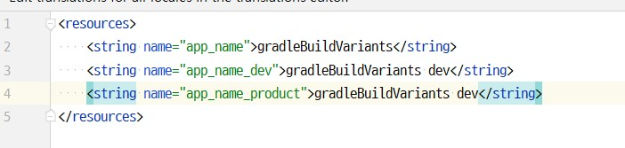
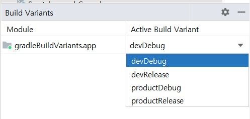
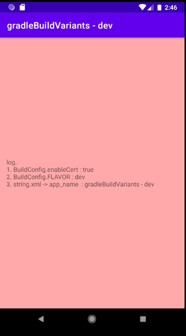
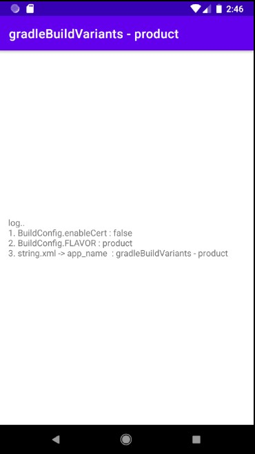

## Gradle Build Variants
> 빌드 시, 내부테스트 또는 서비스, 개발 등으로 분류해야 할 경우가 종종있다.
> 그럴 경우, Android Studio에서는 Gradle의 Build Variants를 이용하여 환경설정 및 부분적인 리소스 및 기능 변경을 지정한다.  
> 다음은 가장 흔하게 사용되는 Build Variants의 예시이다.

1. app 폴더 및의 build.gradle에 [productFlavors] 정보를 추가한다.
~~~groovy
    // Android Studio 3.0이후에는 flavorDimensions를
    // 반드시 정의하고 각 항목에서 dimension으로 정의해야 한다.
    // android{}안의 대부분의 값들을 재정의 할 수 있다.
    flavorDimensions "target"
    productFlavors {
        // product
        product {
            dimension "target"
            versionCode 10
            versionName "product"

            // 리소스를 재정의 가능하다. 리소스이름_variant.name 형태로 지정한다.
            // 반드시 리소스이름 단독으로된 파일은 없어야 한다.
            resValue "string", "app_name", "@string/app_name_product"

            // 변수를 정의하여 값을 관리
            buildConfigField 'boolean', 'enableCert', "false"
        }

        // dev
        dev {
            dimension "target"
            //  applicationId : package 명을 바꿀 수 있다.
            applicationId "com.psw.gradlebuildvariants.dev"
            versionCode 1
            versionName "dev"

            // 리소스를 재정의 가능하다. 리소스이름_variant.name 형태로 지정한다.
            // 반드시 리소스이름 단독으로된 파일은 없어야 한다.
            resValue "string", "app_name", "@string/app_name_dev"

            // 변수를 정의하여 값을 관리
            buildConfigField 'boolean', 'enableCert', "true"
        }
    }
~~~
- Android Studio 3.0이후에는 flavorDimensions 정의를 반드시 추가해야 한다. 그리고 productFlavors 항목안에 dimension으로 선언해야 한다.
- 기본적으로 android {} 안의 값을 대부분 재정의 가능하다.
  - applicationId는 패키지명이다. 때에 따라 패키지명을 바꾸어야 할 경우, 정의하면 된다.
  - resValue는 리소스를 정의할 때 사용된다. 리소스이름_variant.name 형태로 지정한다. **반드시 리소스이름 단독으로된 파일은 없어야 한다.**

  - buildConfigField 새롭게 변수를 정의하여 값을 관리할 때 사용한다.

2. 위와 같이 환경을 설정했다면, 다음과 같이 Android Studio 좌측 탭의 Build Variants를 선택 시 설정된 빌드환경을 선택할 수 있다.

3. 리소스나 소스 파일의 경로도 재정의 가능하다. **재정의된 폴더에는 일반적으로 변경된 파일만 저장해놓는다.**
~~~groovy
    sourceSets{
        // 찾고자 하는 파일이
        // 해당폴더에 없으면 디폴드 경로에서 파일을 찾는다.
        dev{
            res.srcDirs = ['src/dev/res']
        }
    }
~~~

예제를 실행시키기 위해 Android Studio 4.X 때부터 변경된 kotlin view binding 정책을 사용목적으로 다음과 같이 설정한다.
~~~groovy
    buildFeatures {
        viewBinding true
    }
~~~

4. 위와 같이 설정하고 테스트를 위해 다음과 같은 코드를 작성한다.
~~~kotlin
package com.psw.gradlebuildvariants

import androidx.appcompat.app.AppCompatActivity
import android.os.Bundle
import android.widget.TextView
import com.psw.gradlebuildvariants.databinding.ActivityMainBinding

class MainActivity : AppCompatActivity() {
    lateinit var binding : ActivityMainBinding
    override fun onCreate(savedInstanceState: Bundle?) {
        super.onCreate(savedInstanceState)
        binding = ActivityMainBinding.inflate(layoutInflater)
        setContentView(binding.root)

        binding.apply {
            message addLog "BuildConfig.enableCert : ${BuildConfig.enableCert}"
            message addLog "BuildConfig.FLAVOR : ${BuildConfig.FLAVOR}"
            message addLog "string.xml -> app_name  : ${resources.getString(R.string.app_name)}"
        }
    }
}

infix fun TextView.addLog(s : String){
    val nCount = text.split("\n").size
    this.text = "${text}\n${nCount}. ${s}"
}
~~~
5. dev와 product를 설정하고 빌드하면 다른결과 화면을 볼 수 있다.
  - dev

  - product

6. 최종파일을 다른이름으로 빌드하고 싶다면 일반적으로 다음과 같은 설정을 사용한다.
~~~groovy
    applicationVariants.all { variant ->
        def date = new Date()
        def formattedDate = date.format('yyyyMMdd_HHmmss')
        variant.outputs.all {
            outputFileName = "${variant.name}-${variant.versionName}-${variant.versionCode}_${formattedDate}.apk"
        }
    }
~~~

